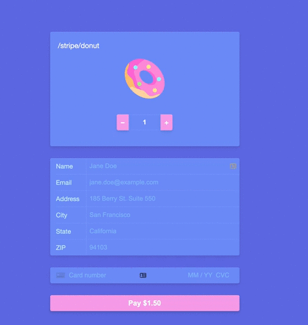

## Stripe Paymente Integration
### Eventual Requirements

- you will need to sign up for a Stripe account if you haven't already: [stripe.com/register](https://stripe.com/register)
- you will need to add your account's secret key and publishable key to the `next.config.js` file

